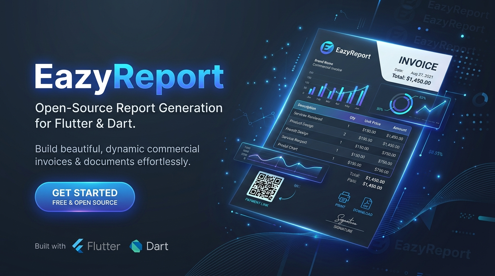

<div align="center">



# eazyreport (Python)

**Ultra-fast, zero-JS report generation engine for Python.**  
*Native HTML, vector SVG charts, barcodes/QR codes, and direct vector PDF export without any JavaScript runtime.*

[](https://github.com/ashiq-kodali/eazyreport-py/actions)
[](https://www.python.org/downloads/)
[](LICENSE)
[-brightgreen.svg)](#why-zero-js)

</div>

---

## 🌟 Overview

`eazyreport` is a enterprise-grade reporting engine written in 100% pure Python. It allows developers to design visual `.rtpl` reports (invoices, purchase orders, shipping labels, financial statements, analytics summaries) and render them into **pixel-perfect printable HTML** and **native vector PDF documents**.

Unlike other report engines that require headless Chromium, Node.js, PyExecJS, or WebKit, `eazyreport` evaluates Handlebars-style templates and FastReport logic **entirely inside Python**.

---

## ⚡ Why Zero-JS?

| Traditional Reporting (Puppeteer / Node / JS2Py) | **eazyreport (Pure Python)** |
| :--- | :--- |
| ❌ Heavy headless Chromium (~300MB RAM per process) | 🚀 **Under 15MB RAM footprint** |
| ❌ Node.js / PyExecJS / V8 binary runtime dependencies | 🚀 **100% pure Python execution** |
| ❌ Fragile cross-platform installs on Alpine / Lambda | 🚀 **Instantly runs on AWS Lambda, Cloud Run, Alpine Docker** |
| ❌ High cold-start times (1-3 seconds) | 🚀 **Sub-millisecond pagination and rendering** |

---

## 🚀 Key Features

- **Handlebars Expression Engine**: 35+ built-in helpers (`formatCurrency`, `formatDate`, `formatNumber`, `formatPercent`, `sum`, `avg`, `count`, `math`, `numberToWords`, `iif`, string transforms). Supports recursive subexpression parentheses `(gt item.qty 10)`.
- **FastReport Conditional Logic**: Automatic rule evaluation (`empty`, `equals`, `gt`, `lt`, `contains`, `starts_with`) driving dynamic actions (`hide`, `skip`, `background`, `text_color`, `font_weight`).
- **Two-Pass Pagination**: Multi-pass pagination resolving total page counts (`[TotalPages]` & `[Page]`), page headers/footers, group bands with aggregate calculations, and child bands (`fillUnusedSpace` & `keepWithParent`).
- **Pure SVG Vector Charts**: Built-in SVG chart generator producing column, horizontal bar, line, area, pie, and doughnut charts without external charting libraries.
- **Barcodes & QR Codes**: Native vector generation for Code 128, Code 39, EAN-13, and 2D QR codes.
- **Dual Export**: Generates standalone, responsive HTML ready for browser viewing/printing, as well as direct vector PDF byte streams via ReportLab.

---

## 📦 Installation

```bash
pip install eazyreport
```

Or install directly from GitHub:

```bash
pip install git+https://github.com/ashiq-kodali/eazyreport-py.git
```

---

## 🛠️ Quickstart

### 1. Fluent Builder API

```python
from eazyreport import ReportBuilder

# Load template from file, dict, or JSON string
builder = (
    ReportBuilder("invoice.rtpl")
    .data({
        "invoiceNumber": "INV-2026-001",
        "issueDate": "2026-10-02",
        "customer": {"name": "Acme Global Logistics"},
        "items": [
            {"sku": "SRV-01", "description": "Cloud Consultation", "qty": 10, "unitPrice": 150.00, "total": 1500.00},
            {"sku": "LIC-02", "description": "Enterprise License", "qty": 1, "unitPrice": 2400.00, "total": 2400.00},
        ],
        "grandTotal": 3900.00,
    })
    .params({"Company": "EazyCorp Inc."})
)

# 1. Render Standalone Printable HTML
html_output = builder.to_html()
with open("invoice.html", "w", encoding="utf-8") as f:
    f.write(html_output)

# 2. Render Native Vector PDF
pdf_bytes = builder.to_pdf()
with open("invoice.pdf", "wb") as f:
    f.write(pdf_bytes)

# 3. Inspect Page Count
print(f"Total Pages Generated: {builder.page_count()}")
```

### 2. High-Level Functional API

```python
from eazyreport import get_report_html, get_report_pdf, count_report_pages

# Get HTML string directly
html_doc = get_report_html("template.rtpl", data=data, params=params)

# Get PDF bytes directly
pdf_data = get_report_pdf("template.rtpl", data=data, params=params)

# Count total pages
pages = count_report_pages("template.rtpl", data=data)
```

---

## 🧩 Built-in Expression Helpers

| Helper | Syntax Example | Description |
| :--- | :--- | :--- |
| **`formatCurrency`** | `{{formatCurrency item.total "USD" 2}}` | Formats number as currency with symbol |
| **`formatNumber`** | `{{formatNumber item.qty 0 true}}` | Formats number with decimals & thousands commas |
| **`formatDate`** | `{{formatDate issueDate "dd/MM/yyyy"}}` | Formats datetime with custom pattern tokens |
| **`formatPercent`** | `{{formatPercent discount 1}}` | Formats ratio to percentage string (`85.4%`) |
| **`numberToWords`** | `{{numberToWords grandTotal}}` | Cheque amount in English words (`One Hundred Twenty-Five and 50/100`) |
| **`sum`** | `{{sum items "total"}}` | Calculates sum of fields across list |
| **`avg`** | `{{avg items "unitPrice"}}` | Calculates arithmetic mean of field |
| **`count`** | `{{count items}}` | Counts number of items in list |
| **`iif`** | `{{iif (gt qty 10) "Bulk" "Single"}}` | Inline ternary condition |
| **`gt` / `lt` / `eq`** | `(gt item.qty 10)` | Comparison operators for subexpressions |
| **`add` / `sub` / `mul`** | `{{mul item.qty item.unitPrice}}` | Arithmetic operators |
| **`titlecase`** | `{{titlecase customer.name}}` | Converts string to Title Case |

---

## 🧪 Running Tests

The test suite covers expressions, pagination, two-pass `[TotalPages]` calculation, SVG vector charts, barcodes, and real commercial invoice templates:

```bash
pytest -v tests
```

---

## 📄 License

Distributed under the **MIT License**. See [LICENSE](LICENSE) for details.

Developed with ❤️ by **[Ashiq Kodali](https://github.com/ashiq-kodali)** (`itzmeask@gmail.com`).
